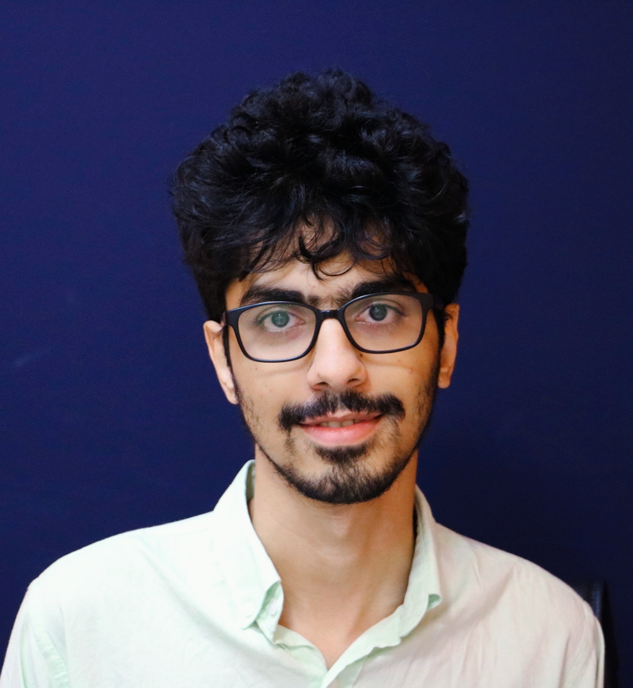

@def title = "Radmehr Karimian"

~~~

  

    
    

    I am a Senior Bachelor student in the Sharif University of Technology Electrical Engineering Department advised by Professor <a href=https://sharif.edu/~khalaj/#Research> Babak Khalaj</a>. My research interests include Statistical Learning and Inferences, Learning Theory (especially Fairness, Privacy and Robustness), Federated Learning, Optimization and applied AI and learning in communication systems & IoT. 
    I'm also working with Professor <a href=https://www.imperial.ac.uk/people/d.gunduz> Deniz Gunduz</a> at Imperial College London IPC Lab as a research intern on  Applied Deep Learning for Wireless Communication. Another project that I'm involved in is Joint Source-Channel Coding for video and image transmission.
    

    Currently, I'm Working On Robust Semi-Supervised Learning with Dr.<a href=https://www.turing.ac.uk/people/researchers/gholamali-aminian> Gholamali Aminian</a> and Professor <a href=https://scholar.google.com/citations?user=Y6vuiBUAAAAJ> Mohammad Hossein Yassaee</a> .
    

   You can reach me at <code>radmehr.karimian@gmail.com</code>. A copy of my CV is available <a href="assets/Radmehr_Karimian_s_CV_SAFE.pdf"> here</a>.
    

    

      
  

~~~
